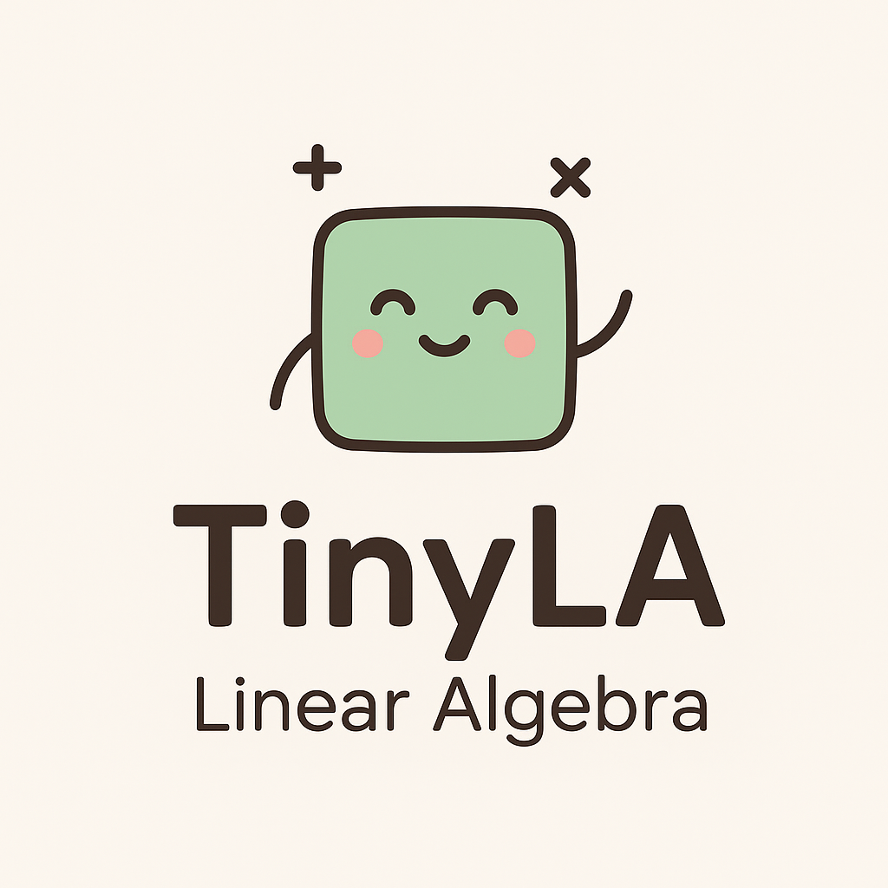

<div align="center">

</div>

A header-only C++ template library for linear algebra operations with simple forward-mode automatic differentiation and CUDA support, with emphasis on ease-of-use.


## Installation
Using CMake, you can fetch the content of this repository using FetchContent as follows
```cmake
FetchContent_Declare(TinyLA_content
    GIT_REPOSITORY https://github.com/TheFlyingPiano99/LinAlgLib.git
    GIT_TAG main
    GIT_SHALLOW TRUE)
FetchContent_MakeAvailable(TinyLA_content)

target_link_libraries(${YOUR_TARGET} PRIVATE TinyLA::TinyLA)
```
Alternatively, you can copy the `TinyLA.h` file into your project's own include folder. In this case make sure to define the `ENABLE_CUDA_SUPPORT` flag in your source code if you want to use the library with CUDA!

## Examples

### Basic Vector Operations

```cpp
#include "TinyLA.h"
#include <iostream>
//...

// Create 3D vectors
// Create a fixed size vector:
auto v1 = TinyLA::Vec<double, 3>{1.0, 2.0, 3.0};
// Alias for common sizes and types:
auto v2 = TinyLA::DVec3{4.0, 5.0, 6.0};

// Vector arithmetic:
auto sum = v1 + v2;           // Vector addition
auto scaled = v1 * 2.0;       // Scalar multiplication
auto dotProduct = TinyLA::dot(v1, v2);  // Dot product
auto crossProduct = TinyLA::cross(v1, v2);  // Cross product
auto twoNorm = TinyLA::norm<2>(v1);
std::cout << TinyLA::to_string(twoNorm) << std::endl;
```

### Matrix Operations

```cpp
// Create a 4x4 identity matrix
auto matA = TinyLA::Mat<double, 4, 4>::identity();
auto matB = TinyLA::DMat4::identity();
matA[0][1] = 2.0;  // Modify an element

// Matrix multiplication
auto matC = matA * matB + TinyLA::transpose(matA);

// Matrix-vector multiplication
auto v = TinyLA::Vec4<double>{1.0, 2.0, 3.0, 4.0};
auto result = matC * v;

std::cout << "Resulting vector: " << TinyLA::to_string(result) << std::endl;
```

### Automatic Differentiation

```cpp
// Create a dual number for automatic differentiation
auto x = TinyLA::Dual<double>{TinyLA::PI<double>, 1.0};  // f(x) = π, df/dx = 1

// Compute function and derivative simultaneously
auto result = TinyLA::sin(x) + 1.0;

std::cout << "f(x) = sin(pi) + 1 = " << result.fx() << std::endl;
std::cout << "f'(x) = cos(pi) = " << result.dfxdx() << std::endl;
```

### Complex Numbers with Differentiation

```cpp
    // Vectors with complex dual numbers
    auto cVec = TinyLA::Vec3<TinyLA::Dual<std::complex<double>>>{};
    cVec.x() = TinyLA::initVariableWithDiffOrder<1>(std::complex<double>{1.0, 0.0});
    cVec.y() = TinyLA::initVariableWithDiffOrder<1>(std::complex<double>{0.5, 2.0});
    cVec.z() = TinyLA::initVariableWithDiffOrder<1>(std::complex<double>{1.0, 1.0});

    auto complexResult = TinyLA::dot(cVec, cVec);   // Sum_i a_i * conj(b_i)
    std::cout << "Complex dot product: " << TinyLA::to_string(complexResult) << std::endl;
```

### Polynomial Equation Solving

```cpp
// Solve quadratic equation: x² + 1 = 0
auto solution = TinyLA::solveQuadraticEquation<TinyLA::RootDomain::Complex>(1.0, 0.0, 1.0);

std::cout << "Number of roots: " << solution.root_count << std::endl;
std::cout << "Root 1: " << TinyLA::to_string(std::get<0>(solution.roots)) << std::endl;
std::cout << "Root 2: " << TinyLA::to_string(std::get<1>(solution.roots)) << std::endl;
```


## License

This project is licensed under the MIT License - see the [LICENSE](LICENSE) file for details.

Copyright (c) 2025 Zoltán Simon

The MIT License is a permissive license that allows you to use, modify, and distribute this software freely, including for commercial purposes, as long as you include the original copyright notice and license text.

